# 客户宽带管理系统
学校网络中心对学生宿舍开通宽带业务提供一个管理平台，开发客户宽带管理系统。该系统基于SSM框架，主要功能包括用户管理，权限管理，员工管理，登录管理，客户管理（学生），订单管理(校园宽带业务)等6个模块。

登录页面

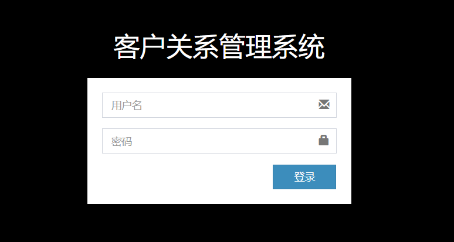

主页

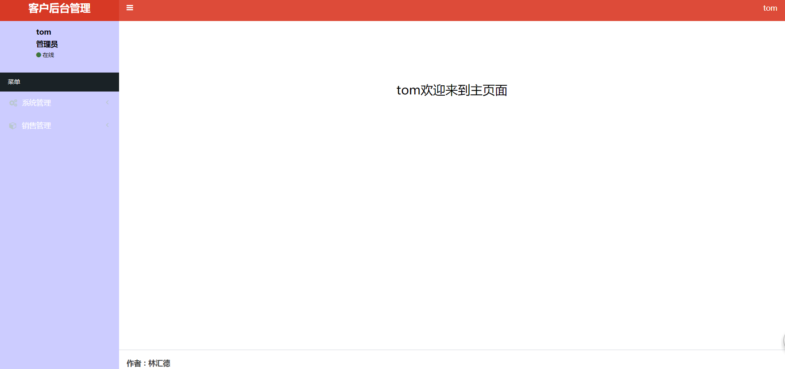

侧边栏

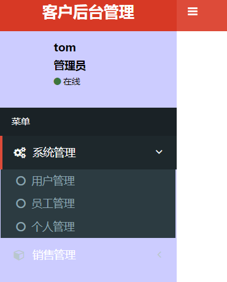

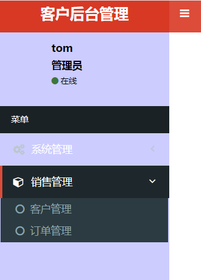

用户页面

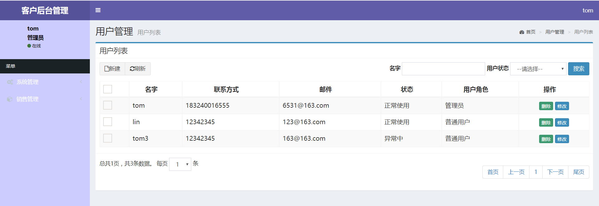

新建拟态框

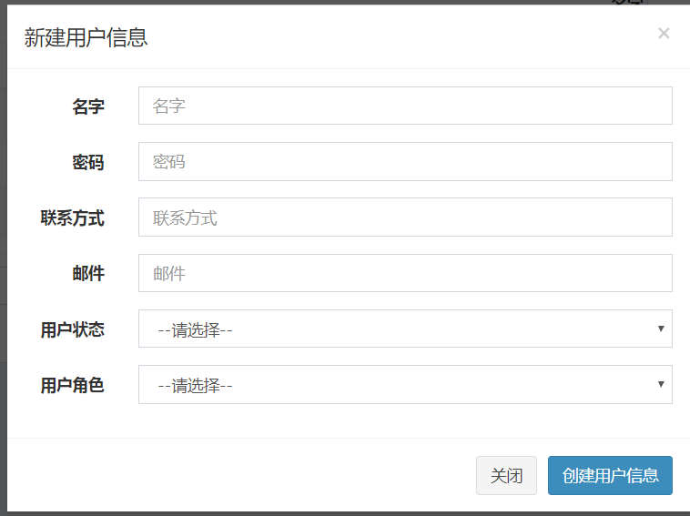

修改拟态框

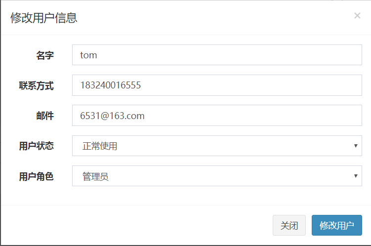

权限界面

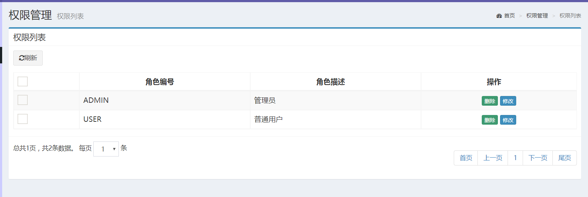

修改拟态框

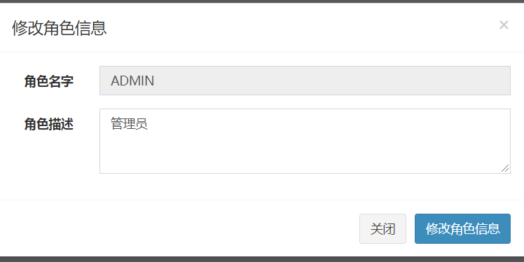

个人界面

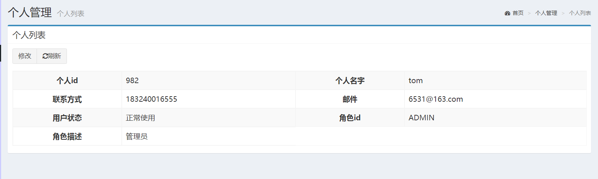

修改拟态框

顾客界面

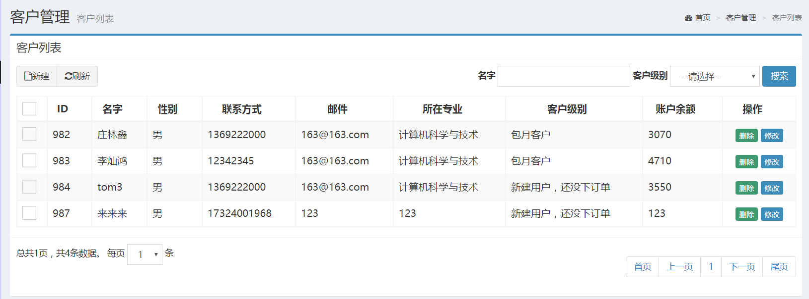

新建拟态框

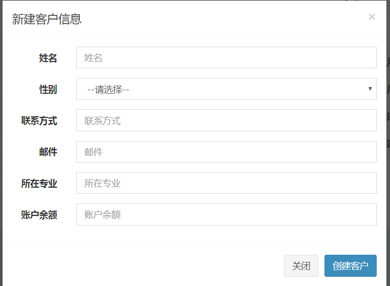

修改拟态框

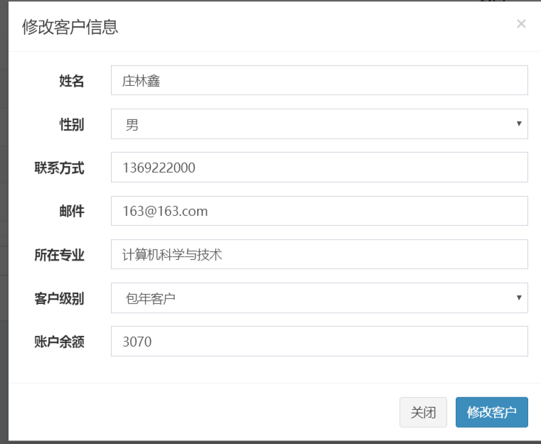

顾客界面

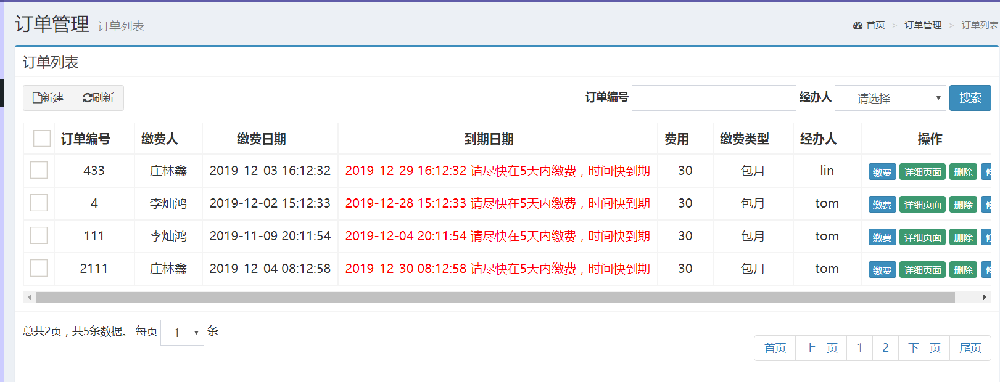

新建拟态框

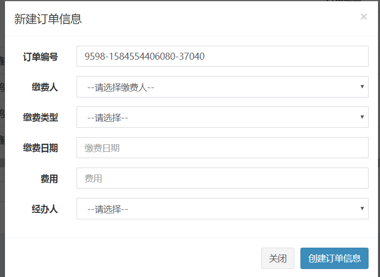

修改拟态框

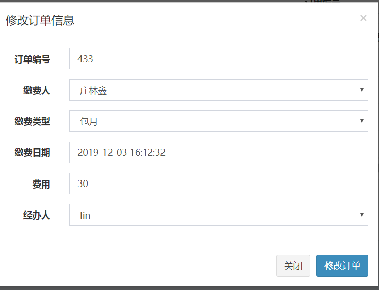

缴费拟态框

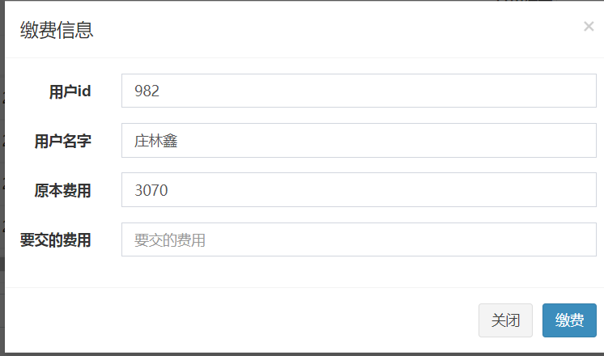

订单信息页面

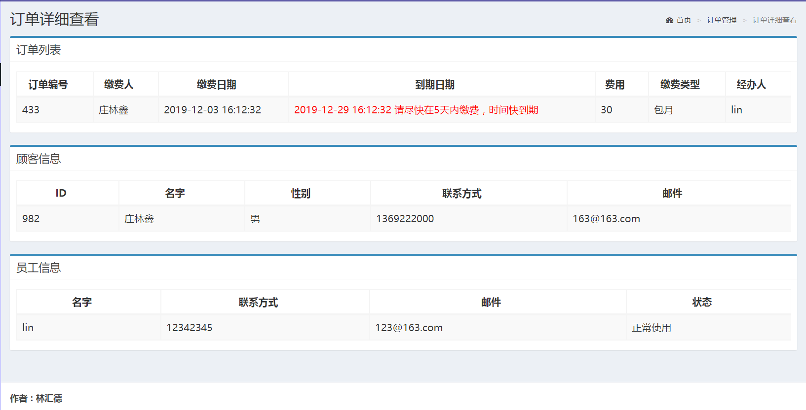

修改密码界面

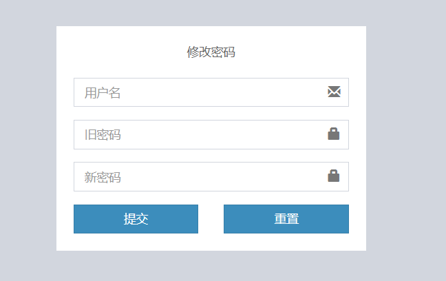